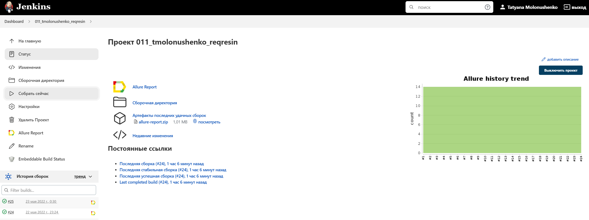
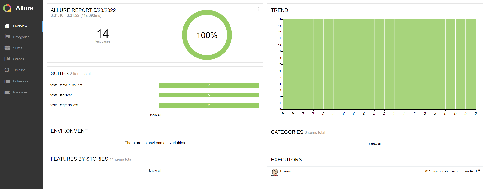
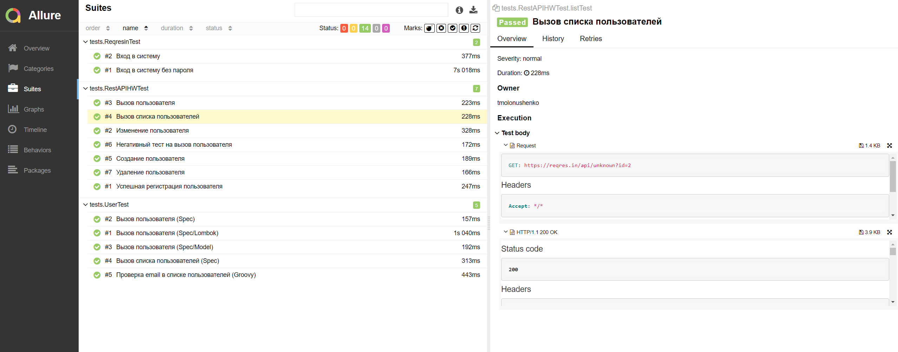
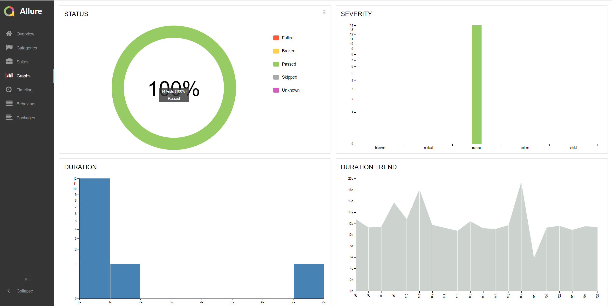
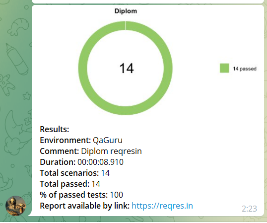

# Автоматизированные тесты для
https://reqres.in/
-----

### Технологии используемые в проекте

* [Java](https://www.oracle.com/java/) - для написания тестов
* [Gradle](https://gradle.org) - для сборки проекта
* [JUnit 5](https://junit.org/junit5/) - для запуска тестов
* [Selenide](https://selenide.org) - для тестирования UI
* [Rest-Assured](https://rest-assured.io) - для тестирования API
* [Jenkins](https://www.jenkins.io/) - для обеспечения процесса непрерывной интеграции
* [Selenoid](https://aerokube.com/selenoid/) - для запуска UI тестов в [Docker containers](https://www.docker.com/resources/what-container)
* [Allure TestOps](https://docs.qameta.io/allure-testops/) и [Allure Report](http://allure.qatools.ru) - для управления тестами, анализа их прохождения и оформления отчетности
* [Telegram Bot](https://core.telegram.org/bots) - для оповещения о прохождении тестов
---

#### Список проверок, реализованных в автотестах
- [x] Вызов пользователя
- [x] Возвращение ошибки при отсутствии пароля
- [x] Вызов списка пользователей
- [x] Создание пользователя
- [x] Изменение данных пользователя
- [x] Удаление пользователя
- [x] Успешная регистрация пользователя
- [x] Проверка email в списке пользователей (Groovy)

##  Запуск тестов в [Jenkins](https://jenkins.autotests.cloud/job/011_tmolonushenko_reqresin/)

---

##  Отчет о результатах тестирования в [Allure Report](https://jenkins.autotests.cloud/job/011_tmolonushenko_sotoFoto/allure/)

----

### Список тестов c описанием тестов

### Графики

###  Проект интегрирован с Allure TestOps

---

## Тест-кейсы с историей запусков

## Дашборд

---
##  Уведомление в Telegram

---

